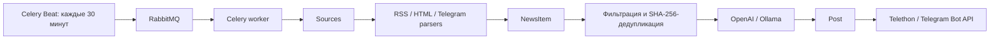

# aibot — AI-генератор Telegram-постов

Учебный сервис собирает новости из RSS, HTML и публичных Telegram-каналов,
фильтрует и дедуплицирует их, генерирует русскоязычные посты через OpenAI или
локальный Ollama и публикует результат через Telethon или Telegram Bot API.

## Возможности

- FastAPI Management API и Swagger/OpenAPI;
- управление источниками и ключевыми словами с мягким отключением записей;
- ручной и автоматический сбор RSS/Atom, HTML и публичных Telegram-каналов;
- SHA-256-дедупликация и регистронезависимая include/exclude-фильтрация;
- read-only API собранных NewsItem;
- генерация Post через OpenAI Responses API или Ollama Chat API;
- публикация через Telethon или Telegram Bot API с защитой от повторной отправки
  уже опубликованного Post;
- Celery worker, RabbitMQ и Celery Beat с pipeline каждые 30 минут;
- PostgreSQL, async SQLAlchemy, Alembic и воспроизводимый Docker Compose запуск.

Redis запускается в Compose как подготовленная инфраструктура, но приложение,
Celery и pipeline его сейчас не используют.

## Архитектура



FastAPI предоставляет ручной поток, Celery переиспользует те же сервисы для
автоматического. PostgreSQL хранит Source, Keyword, NewsItem, Post и M:N-связи
Post–NewsItem. Подробные границы модулей приведены в
[`docs/project_map.md`](docs/project_map.md).

## Технологии

- Python 3.12–3.13, FastAPI, Uvicorn, Pydantic;
- SQLAlchemy AsyncIO, asyncpg, PostgreSQL 16, Alembic;
- Celery, RabbitMQ, Celery Beat;
- httpx, feedparser, Beautiful Soup, Telethon;
- OpenAI Python SDK и Ollama HTTP API;
- pytest, Ruff, mypy;
- Docker и Docker Compose.

## Требования

Для основного запуска нужны Docker и Docker Compose. Для локальных quality gates
нужен Python 3.12 или 3.13 и зависимости группы `dev`.

Для реальной демонстрации генерации и публикации дополнительно нужны:

- запущенный на хосте Ollama с доступной моделью `gemma4:e4b`;
- Telegram-бот и приватный тестовый канал, в котором боту разрешена публикация.

Ollama не входит в Compose и запускается на машине пользователя. Модель и Telegram
credentials не распространяются вместе с репозиторием.

## Конфигурация

Скопируйте `.env.example` в `.env` и замените демонстрационные пароли. Не помещайте
реальные токены или API-ключи в Git. Полный перечень и ограничения параметров
находятся в [`.env.example`](.env.example).

### Приложение

- `APP_ENV=dev|test|prod` — режим приложения; для Compose используйте `prod`;
- `LOG_LEVEL` — уровень логирования;
- `MAX_NEWS_PER_SOURCE` — максимум элементов от одного parser за запуск;
- `PARSE_INTERVAL` сохранён в конфигурации, но Beat использует фиксированное
  расписание `*/30`, а не это значение.

Текущий Compose передаёт `APP_ENV` и `LOG_LEVEL`, но не передаёт `APP_NAME`,
`PARSE_INTERVAL` и `MAX_NEWS_PER_SOURCE`; контейнеры используют их Python defaults.
Эти параметры `.env` применяются при локальном запуске процесса.

### PostgreSQL

- `POSTGRES_DB`, `POSTGRES_USER`, `POSTGRES_PASSWORD` создают Compose-БД;
- `DATABASE_URL` обязателен для локального процесса и тестов и принимает только
  `postgresql+asyncpg://...`;
- внутри Compose `DATABASE_URL` строится из `POSTGRES_*` и hostname `postgres`.

### RabbitMQ и Celery

- `RABBITMQ_USER`, `RABBITMQ_PASSWORD` настраивают Compose RabbitMQ;
- `RABBITMQ_URL` нужен локально запущенным worker/Beat; внутри Compose он строится
  из инфраструктурных переменных;
- `AUTO_PUBLISH=false` создаёт Post, но не отправляет его автоматически;
- `AUTO_PUBLISH=true` разрешает реальную внешнюю отправку Telegram;
- `PIPELINE_MAX_POSTS_PER_RUN` — максимум Post за запуск, допустимо 1–10;
- `PIPELINE_NEWS_PER_POST` — максимум NewsItem в одном Post, допустимо 1–10.

### Выбор AI-провайдера

- `AI_PROVIDER=openai|ollama` выбирает backend;
- для Ollama используются `OLLAMA_BASE_URL`, `OLLAMA_MODEL`, `OLLAMA_TIMEOUT`;
- для OpenAI нужны `OPENAI_API_KEY`, `OPENAI_MODEL`, `OPENAI_MAX_TOKENS`.

OpenAI и Ollama необязательны при старте приложения, но один из них должен быть
корректно настроен перед вызовом generation API или pipeline с новыми новостями.

### Выбор Telegram publisher

- `TELEGRAM_PUBLISHER=telethon|bot` выбирает способ публикации;
- Bot API использует `TELEGRAM_BOT_TOKEN` и `TELEGRAM_TARGET_CHAT_ID`;
- Telethon publication использует `TELEGRAM_API_ID`, `TELEGRAM_API_HASH`,
  `TELEGRAM_SESSION_NAME` и `TELEGRAM_TARGET_CHANNEL`.

Credentials Telegram ingestion отличаются от Bot API publication. Parser
публичных Telegram-каналов всегда использует `TELEGRAM_API_ID`,
`TELEGRAM_API_HASH` и заранее авторизованную Telethon session. Bot token для
ingestion не используется.

## Подготовка Ollama

1. Установите и запустите Ollama на хосте.
2. Убедитесь, что валидированная проектом модель доступна:

   ```powershell
   ollama list
   ollama show gemma4:e4b
   ```

3. Укажите `AI_PROVIDER=ollama` и `OLLAMA_MODEL=gemma4:e4b`.
4. Для Compose используйте
   `OLLAMA_BASE_URL=http://host.docker.internal:11434` — этот адрес проверен с
   Docker Desktop. Для локального Python-процесса используйте
   `http://127.0.0.1:11434`.

`gemma4:e4b` в проверенной среде является локально установленным tag. Репозиторий
не содержит модель и не утверждает, что этот tag доступен через публичный
`ollama pull`; подготовьте его из доверенного источника среды оценивания.

## Подготовка Telegram Bot API

1. Создайте отдельного тестового бота через BotFather.
2. Добавьте его администратором в приватный тестовый канал и разрешите публикацию.
3. Опубликуйте тестовую запись и через доверенный Bot API-клиент прочитайте
   `channel_post.chat.id` из `getUpdates`. Не сохраняйте URL с bot token в истории
   команд или документации.
4. Задайте `TELEGRAM_PUBLISHER=bot`, `TELEGRAM_BOT_TOKEN` и полученный
   `TELEGRAM_TARGET_CHAT_ID` вида `-100...`.

Проект публикует plain text в один настроенный target. Для evaluation не
используйте рабочий канал.

## Запуск через Docker Compose

Основной проверенный запуск:

```powershell
docker compose up -d --build
```

Compose запускает:

- `postgres` — PostgreSQL с healthcheck;
- `migrate` — одноразовый `alembic upgrade head`, завершается с exit code 0;
- `app` — Uvicorn `app.main:app` на порту 8000 после успешной миграции;
- `rabbitmq` — broker Celery с healthcheck;
- `worker` — один Celery worker с `--concurrency=1`;
- `beat` — стандартный Celery Beat;
- `redis` — подготовленный сервис, не являющийся зависимостью app/pipeline.

## Проверка запуска

```powershell
docker compose ps
```

Ожидается: `postgres`, `rabbitmq` и `app` имеют состояние healthy; `migrate`
завершён с code 0; `worker` и `beat` работают.

- process liveness: `GET http://localhost:8000/api/health` → `{"status":"ok"}`;
- Swagger UI: <http://localhost:8000/docs>;
- OpenAPI JSON: <http://localhost:8000/openapi.json>.

Health endpoint намеренно не проверяет PostgreSQL, RabbitMQ, AI или Telegram.

## Ручной демонстрационный сценарий

Запросы удобно выполнять из Swagger. Вместо примерных ID используйте значения из
предыдущих ответов.

### 1. Создать Source

`POST /api/sources`

```json
{
  "name": "Пример RSS",
  "source_type": "rss",
  "url": "https://example.com/feed.xml",
  "enabled": true
}
```

Замените URL на доступную RSS/Atom-ленту. Для HTML используйте `source_type=html`,
для публичного канала — `telegram` и URL вида `https://t.me/channel_name`.

### 2. Создать Keyword

`POST /api/keywords`

```json
{
  "word": "python",
  "type": "include",
  "enabled": true
}
```

Для приоритетного исключения создайте отдельное правило с `type=exclude`.

### 3. Собрать новости

`POST /api/sources/{source_id}/parse`

Успешный ответ содержит счётчики:

```json
{
  "source_id": 1,
  "found": 3,
  "created": 2,
  "duplicates": 1,
  "filtered": 0,
  "errors": 0
}
```

### 4. Прочитать NewsItem

`GET /api/news?status=new` — выберите ID новостей со статусом `new`.

### 5. Сгенерировать Post

`POST /api/generate`

```json
{
  "news_ids": [1, 2]
}
```

Используйте 1–10 существующих NewsItem. Успех создаёт Post со статусом
`generated` и M:N-связями со всеми выбранными новостями.

### 6. Прочитать Post

`GET /api/posts/{post_id}`

### 7. Опубликовать Post

`POST /api/posts/{post_id}/publish`

После успешной внешней отправки `status=published`, `telegram_message_id` и
`published_at` заполнены, а сообщение появляется в настроенном Telegram-канале.
Повторная публикация этой записи возвращает 409 и не вызывает publisher снова.

## Автоматический pipeline

Celery Beat каждые 30 минут отправляет через RabbitMQ задачу
`app.tasks.run_pipeline`. Worker последовательно:

1. разбирает все enabled Source, изолируя ошибки отдельных источников;
2. применяет фильтрацию и дедупликацию;
3. выбирает ещё не связанные с Post новости со статусом `new` в FIFO-порядке;
4. ограничивает выборку параметрами pipeline и делит её на последовательные batch;
5. генерирует Post выбранным AI backend;
6. при `AUTO_PUBLISH=true` публикует каждый успешно созданный Post.

`AUTO_PUBLISH=false` — безопасный default: автоматическая генерация выполняется,
но отправка остаётся ручной. Неудачная публикация оставляет Post в состоянии
`generated`; автоматической retry-очереди для него нет.

### Ручной запуск Celery

Проверенная команда постановки задачи без ожидания Beat:

```powershell
docker compose exec worker celery -A app.tasks.celery_app:celery_app call app.tasks.run_pipeline
```

Result backend отключён, поэтому команда возвращает task ID, а выполнение нужно
наблюдать через:

```powershell
docker compose logs -f worker
```

## API

| Группа | Метод и URL | Назначение |
|---|---|---|
| Health | `GET /api/health` | Process liveness |
| Sources | `POST /api/sources` | Создать Source |
| Sources | `GET /api/sources` | Список, фильтры и пагинация |
| Sources | `GET /api/sources/{id}` | Получить Source |
| Sources | `PATCH /api/sources/{id}` | Частично изменить Source |
| Sources | `DELETE /api/sources/{id}` | Идемпотентно установить `enabled=false` |
| Sources | `POST /api/sources/{id}/parse` | Запустить ingestion вручную |
| Keywords | `POST /api/keywords` | Создать Keyword |
| Keywords | `GET /api/keywords` | Список, фильтры и пагинация |
| Keywords | `GET /api/keywords/{id}` | Получить Keyword |
| Keywords | `PATCH /api/keywords/{id}` | Частично изменить Keyword |
| Keywords | `DELETE /api/keywords/{id}` | Идемпотентно установить `enabled=false` |
| News | `GET /api/news` | Список, фильтры и пагинация |
| News | `GET /api/news/{id}` | Получить NewsItem |
| Generation | `POST /api/generate` | Создать Post из NewsItem |
| Generation | `POST /api/generate/test` | Проверить AI без PostgreSQL-записи |
| Posts | `GET /api/posts` | Список Post |
| Posts | `GET /api/posts/{id}` | Получить Post |
| Posts | `POST /api/posts/{id}/publish` | Отправить Post в Telegram |

Подробные схемы, параметры и ответы ошибок опубликованы в Swagger.

## Тесты и quality gates

Полный pytest использует настоящий отдельный PostgreSQL через единственный
`DATABASE_URL`; SQLite не поддерживается. Migration-тест разрушителен и
отказывается работать с непустой БД. Никогда не направляйте его на полезные данные.

Для тестов задайте `APP_ENV=test` и URL чистой временной PostgreSQL-БД, затем:

```powershell
python -m pytest
python -m ruff check .
python -m mypy app tests alembic
python -m alembic check
```

`alembic check` требует доступную PostgreSQL-БД, уже обновлённую до `head`.
Unit-тесты AI, Telegram и parsers используют fake/mock и не требуют Internet.

## Миграции базы данных

При обычном Compose-запуске одноразовый сервис `migrate` выполняет:

```powershell
python -m alembic upgrade head
```

Для ручного обновления уже запущенного Compose-окружения можно использовать тот
же application image:

```powershell
docker compose run --rm migrate
```

Не выполняйте `downgrade base` на базе с полезными данными.

## Структура проекта

```text
app/
├── api/          # FastAPI routers и HTTP mapping
├── services/     # бизнес-операции, SQL и транзакционные границы
├── parser/       # RSS, HTML, Telegram и единый ParsedNewsItem
├── ai/           # OpenAI/Ollama clients, prompt и выбор backend
├── publisher/    # Telethon/Bot API publication adapters
└── tasks/        # Celery application, Beat schedule и pipeline
alembic/          # async migration environment и initial revision
tests/            # unit и PostgreSQL integration tests
docs/             # актуальная карта архитектуры
.agent/           # metadata и журналы технических этапов, не runtime-код
docker-compose.yml
Dockerfile
```

## Ограничения учебного MVP

- HTML parser поддерживает только профиль списка элементов `article` и не читает
  отдельные страницы материалов;
- Telegram ingestion читает только текст публичных каналов и требует заранее
  авторизованную Telethon session; Compose не монтирует session volume;
- AI-результат не проходит независимую фактологическую проверку;
- при сбое после принятия сообщения Telegram, но до commit PostgreSQL строгая
  distributed exactly-once публикация не гарантируется;
- поддерживается один publication target и plain text без медиа;
- Management API не имеет authentication/authorization;
- нет semantic clustering, retry queue/DLQ и отдельного API истории ошибок;
- Redis подготовлен в Compose, но активным компонентом pipeline не является.

## Соответствие исходному ТЗ

| Требование | Фактическая реализация | Статус |
|---|---|---|
| FastAPI | Management, ingestion, generation, publication, health API | PASS |
| Сбор с сайтов | RSS/Atom и ограниченный HTML-профиль | PASS |
| Публичные Telegram-каналы | Telethon parser, текстовые сообщения, заранее авторизованная session | PASS |
| Celery | Одна задача `app.tasks.run_pipeline`, worker concurrency 1 | PASS |
| RabbitMQ / Redis | RabbitMQ — активный broker; Redis только запускается и не используется | PARTIAL |
| Beat каждые 30 минут | `crontab(minute="*/30")` | PASS |
| AI-генерация | OpenAI Responses API и Ollama Chat API | PASS |
| Keyword-фильтрация | Include/exclude, exclude приоритетен, case-insensitive substring | PASS |
| Язык | Prompt требует русский Post; автоматического определения языка NewsItem нет | PARTIAL |
| Дедупликация | SHA-256: URL+title, а без URL — title+raw_text+published_at; UNIQUE в БД | PASS |
| Telegram publication | Telethon и Bot API, один target, повторный published Post блокируется | PASS |
| Source CRUD | Create/read/update и soft-disable, фильтры, пагинация | PASS |
| Keyword CRUD | Create/read/update и soft-disable, нормализация, фильтры, пагинация | PASS |
| История и ошибки | News/Post list API есть; отдельного error-history API нет | PARTIAL |
| Swagger/OpenAPI | `/docs`, `/openapi.json`, 19 документированных операций | PASS |
| ORM-модели | Source, NewsItem, Post, Keyword и M:N `post_news_items` | PASS |

## Безопасность эксплуатации

- `AUTO_PUBLISH=true` создаёт реальное внешнее сообщение: включайте его только с
  проверенным тестовым target;
- не выводите `.env`, bot token, API key или Telethon session в логи и отчёты;
- удаление Source/Keyword через API — мягкое; миграционные downgrade-команды могут
  быть разрушительными;
- pipeline не логирует полный prompt, NewsItem или Post, но сохраняет технические
  event и ID для диагностики.

## Диагностика

- app healthy, worker не работает — проверьте RabbitMQ health и `RABBITMQ_URL`;
- Ollama недоступен из Docker — проверьте, что он запущен на хосте и используется
  `http://host.docker.internal:11434`;
- Post остаётся `generated` — проверьте publisher credentials, target и доступ к
  Telegram; затем используйте ручной publish endpoint;
- Telegram parser сообщает configuration error — подготовьте авторизованную
  Telethon session в той же runtime-среде, где выполняется parser.
