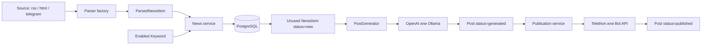
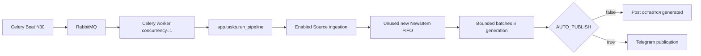

# Карта проекта aibot

## Назначение

`aibot` — учебный сервис подготовки Telegram-постов из внешних новостных
источников. Один набор сервисов используется ручным FastAPI flow и автоматической
Celery-задачей; отдельной repository/UoW-архитектуры нет.

## Компоненты и границы

| Компонент | Модули | Ответственность |
|---|---|---|
| HTTP API | `app/api`, `app/schemas.py`, `app/main.py` | Валидация, OpenAPI и отображение сервисных ошибок в HTTP |
| Сервисы | `app/services` | SQL, транзакции, ingestion, фильтрация, генерация и publication workflow |
| Parser layer | `app/parser` | Получение RSS/HTML/Telegram и единый `ParsedNewsItem`; без записи в БД |
| AI layer | `app/ai` | Общий генератор, prompt, OpenAI/Ollama clients и выбор backend |
| Publisher layer | `app/publisher` | Telethon/Bot API adapters и внешний side effect отправки сообщения |
| Background layer | `app/tasks` | Celery application, Beat schedule и orchestration pipeline |
| Persistence | `app/models.py`, `app/database.py`, `alembic` | Async SQLAlchemy, PostgreSQL schema и миграции |
| Configuration | `app/config.py`, `.env.example` | Проверенные environment-настройки и optional integrations |

Router не выполняет SQL, parser не сохраняет NewsItem, а provider adapters не
управляют транзакциями. Service layer определяет commit/rollback успешных и
ошибочных мутаций.

## Основной поток данных

`Source` владеет своими `NewsItem` через FK с cascade. `NewsItem` и `Post`
связаны M:N таблицей `post_news_items`; удаление одной стороны удаляет только
association rows, но не вторую сущность. `content_hash` остаётся UNIQUE-защитой
от конкурентных дублей.

## Ручной flow

1. Management API создаёт Source и Keyword.
2. `POST /api/sources/{id}/parse` вызывает parser и сохраняет NewsItem.
3. `POST /api/generate` загружает выбранные `new` NewsItem и создаёт Post.
4. `POST /api/posts/{id}/publish` блокирует Post, вызывает выбранный publisher и
   сохраняет Telegram message ID.

`POST /api/generate/test` проверяет AI backend без чтения или записи PostgreSQL.
`GET /api/health` является только process liveness.

## Автоматический flow

Ошибки одного Source, generation batch или publisher учитываются как частичные и
не останавливают независимую работу. Ошибка SQLAlchemy считается
инфраструктурной и завершает задачу. Перед закрытием event loop worker освобождает
общий async engine.

## Внешние интеграции

- PostgreSQL — обязательное постоянное хранилище;
- RabbitMQ — единственный broker Celery, result backend отсутствует;
- Redis — Compose-сервис без активного потребителя;
- OpenAI Responses API и Ollama Chat API — взаимозаменяемые generation backends;
- Telethon — parser публичных каналов и один из publication backends;
- Telegram Bot API — альтернативный publication backend;
- RSS/HTML — внешние HTTP-источники через httpx.

Credentials AI и Telegram необязательны при старте и проверяются при вызове
соответствующей интеграции. Compose запускает Ollama не внутри проекта, а обращается
к процессу на хосте через `host.docker.internal`.

## Топология развёртывания

`docker-compose.yml` поднимает `postgres`, одноразовый `migrate`, `app`,
`rabbitmq`, `worker`, `beat` и подготовленный `redis`. App зависит от успешной
миграции, worker/Beat дополнительно ожидают healthy RabbitMQ. Исходный код в
контейнеры не монтируется; все application-процессы используют один image.
